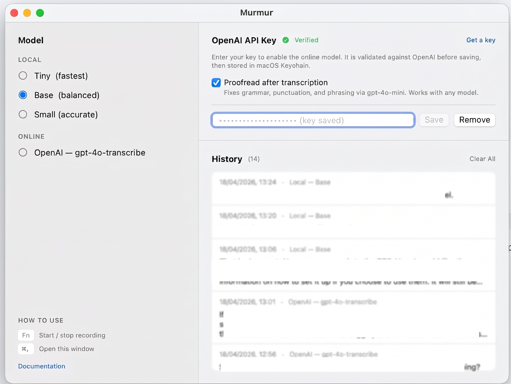

# Murmur

Local voice-to-text dictation for macOS, powered by [Whisper](https://github.com/openai/whisper) running on Apple Silicon via [MLX](https://github.com/ml-explore/mlx).

Press `fn`, speak, press `fn` again — your words are transcribed and pasted wherever the cursor is.



**Works fully offline by default.** Online features (OpenAI transcription and proofread) are optional and require an API key you supply yourself.

---

## Why I built this

I work remotely, which means everything happens through Slack, email, and text — voice calls are rarely an option. Being able to type as fast as I think matters a lot.

I started using a popular AI dictation app to keep up. It worked well enough, but at £19/month it costs as much as a full AI assistant like ChatGPT or Claude. The free tier came with a 2,000 word limit, which disappeared fast. Even on the paid plan, punctuation was hit-or-miss — full stops and commas would often go missing, turning spoken sentences into one long run-on that needed heavy editing afterwards.

So I built Murmur instead. It runs entirely on-device using OpenAI's Whisper model, optimised for Apple Silicon via MLX. No subscription, no word limits, no audio leaving your machine — unless you choose to enable the optional online features.

---

## Requirements

- macOS on Apple Silicon (M1/M2/M3/M4)
- Xcode Command Line Tools (`xcode-select --install`)
- Python 3.13+ (via Homebrew: `brew install python@3.13`)

---

## Install

### Option 1 — Download a prebuilt release (easiest)

Grab the latest `Murmur-X.Y.Z.zip` from [Releases](https://github.com/mhumby/murmur/releases), then:

```bash
unzip Murmur-X.Y.Z.zip
mv Murmur.app /Applications/
xattr -cr /Applications/Murmur.app       # clear the download quarantine flag
open /Applications/Murmur.app
```

The prebuilt app is self-contained but still needs Homebrew Python 3.13 on your Mac: `brew install python@3.13`.

### Option 2 — Build from source

```bash
git clone https://github.com/mhumby/murmur.git
cd murmur
./setup.sh        # creates Python venv, installs ML dependencies
./build_app.sh    # compiles the native Swift app
./install.sh      # installs to /Applications, resets permissions, launches
```

> `install.sh` also resets the macOS permission entries for Murmur so the app re-prompts cleanly on upgrade. Without it, an older granted permission can silently stop working after a rebuild because the ad-hoc signature changed.

On first launch, macOS will prompt for:
- **Accessibility** — required for auto-paste (simulates Cmd+V)
- **Microphone** — required for recording
- **Notifications** — optional, shows transcribed text as a banner

The first recording downloads the Whisper model (~150 MB for "base"). After that it works fully offline.

---

## Usage

| Action | How |
|---|---|
| **Start recording** | Press `fn` or `Option+Space` |
| **Stop and transcribe** | Press `fn` or `Option+Space` again |
| **Open settings / history** | Menu bar icon > Open Murmur, or `Cmd+,` |
| **Quit** | Menu bar icon > Quit Murmur |

### Menu bar icon

| Icon | Meaning |
|---|---|
| Microphone | Idle, ready to record |
| Red circle | Recording — speak now |
| Hourglass | Transcribing (or proofreading) |

A sound plays when recording starts (Tink) and stops (Pop).

---

## Main window

Open the main window from the menu bar or with `Cmd+,`. It has three areas:

### Left sidebar — Model

Pick which transcription backend to use. The selected model persists between sessions.

| Option | Description |
|---|---|
| **Tiny** | Fastest local model. Good for short commands and quick notes. |
| **Base** | Default. Good balance of speed and accuracy for everyday dictation. |
| **Small** | Most accurate local model. Better for longer passages and accented speech. |
| **OpenAI — gpt-4o-transcribe** | Online model via the OpenAI API. Requires an API key (see below). Significantly more accurate for accented speech, technical terms, and noisy environments. |

### Right top — OpenAI API Key

Required to use the online transcription model or the proofread feature. See [Online features](#online-features) below for setup instructions.

### Right bottom — History

Every successful transcription is saved here, newest first, up to 200 entries. The list persists across relaunches.

| Action | How |
|---|---|
| **Copy a result** | Click the row |
| **Delete a result** | Right-click > Delete |
| **Clear all** | "Clear All" button (confirmation required) |

---

## Online features

All online features are **opt-in** and **disabled by default**. If you never add an API key, Murmur behaves identically to previous versions — fully offline, no data sent anywhere.

When online features are active, your audio (for online transcription) or transcribed text (for proofread) is sent to the OpenAI API over HTTPS. Audio is processed according to [OpenAI's usage policy](https://openai.com/policies/api-data-usage-policies).

### Setting up an OpenAI API key

1. Go to [platform.openai.com/api-keys](https://platform.openai.com/api-keys) and create a new key.
2. Open Murmur (`Cmd+,`) and paste the key into the **OpenAI API Key** field.
3. Click **Save**. Murmur validates the key against the OpenAI API before storing it.
4. The key is saved in **macOS Keychain** under the service `com.mhumby.murmur`. It is never written to disk in plaintext, never logged, and never shared.

Once saved, the **OpenAI — gpt-4o-transcribe** model becomes available in the sidebar, and the **Proofread** toggle is unlocked.

To remove the key, click **Remove** in the same section. This deletes it from Keychain immediately.

### Online transcription (gpt-4o-transcribe)

Select **OpenAI — gpt-4o-transcribe** in the model sidebar. Your recorded audio is uploaded to `POST /v1/audio/transcriptions` with the `gpt-4o-transcribe` model.

Compared to local Whisper models:

| | Local Whisper | gpt-4o-transcribe |
|---|---|---|
| **Cost** | Free | ~$0.006/min |
| **Privacy** | Audio stays on device | Audio sent to OpenAI |
| **Speed** | Instant (on-device) | Adds ~1-3s network round-trip |
| **Accuracy** | Good for clear speech | Significantly better for accents, noisy environments, and technical vocabulary |
| **Punctuation** | Variable by model size | Consistent, natural punctuation |

### Proofread

The **Proofread after transcription** toggle (in the OpenAI section) adds a second pass through `gpt-4o-mini` after any transcription — local or online. It fixes grammar, punctuation, capitalisation, and phrasing, and removes filler words (um, uh, like, you know).

The factual content of what you said is never changed — only how it is expressed.

Cost is negligible: a typical 30-second dictation produces around 100 words, which costs well under $0.001 for the proofread pass.

If the proofread call fails for any reason (network error, rate limit), Murmur falls back silently to the raw transcription so nothing is lost.

---

## macOS setup

### fn key

By default, macOS maps the `fn`/Globe key to the emoji picker. To use it with Murmur:

1. Open **System Settings** > **Keyboard**
2. Set **"Press fn key to"** to **"Do Nothing"**

### Accessibility troubleshooting

If text doesn't auto-paste after transcription:

1. Open **System Settings** > **Privacy & Security** > **Accessibility**
2. Remove any old Murmur entries
3. Click **+** and add **Murmur** from `/Applications/Murmur.app`
4. Make sure the toggle is **on**
5. Quit and relaunch Murmur

---

## Models

Local models are downloaded on first use from [Hugging Face](https://huggingface.co/mlx-community) and cached at `~/.cache/huggingface/hub/`.

| Model | Download size | Speed | Best for |
|---|---|---|---|
| **Tiny** | ~75 MB | Fastest | Quick notes, short commands |
| **Base** | ~150 MB | Fast | General dictation (default) |
| **Small** | ~500 MB | Moderate | Longer passages, accented speech |
| **gpt-4o-transcribe** | — (cloud) | Fast + network | High-accuracy dictation, noisy environments |

---

## Architecture

Murmur is a **native Swift menu bar app** that calls Python only for local ML inference:

```
┌────────────────────────────────────────┐
│           Murmur.app (Swift)           │
│  - Menu bar + hotkeys (fn, Option+Spc) │
│  - Main window (SwiftUI)               │
│  - Accessibility paste (CGEvent)       │
│  - History (JSON), Settings (Keychain) │
└──────┬─────────────────────┬───────────┘
       │ subprocess          │ URLSession (HTTPS)
 ┌─────▼──────┐   ┌──────────▼──────────────────┐
 │ record_cli │   │       OpenAI API             │
 │  (Python)  │   │  /v1/audio/transcriptions    │
 │sounddevice │   │  /v1/chat/completions        │
 └─────┬──────┘   └─────────────────────────────┘
       │ WAV file
 ┌─────▼──────────────────┐
 │    transcribe_cli.py   │  (local path only)
 │       mlx-whisper      │
 └────────────────────────┘
```

1. **Hotkey** — Swift registers `fn` and `Option+Space` via `NSEvent` global monitor
2. **Recording** — Python subprocess captures audio at 16 kHz, saves to WAV
3. **Silence trimming** — trailing silence is stripped to prevent Whisper hallucinations
4. **Transcription** — either local (`mlx-whisper` via Python subprocess) or online (`gpt-4o-transcribe` via URLSession)
5. **Proofread** — optional second pass through `gpt-4o-mini` via URLSession
6. **Paste** — Swift copies final text to clipboard and simulates `Cmd+V` via `CGEvent`

---

## Project structure

```
murmur/
  swift/
    main.swift             app entry point, AppDelegate, recording, paste
    Transcribers.swift     Transcriber protocol, LocalMLXTranscriber, OpenAITranscriber
    AppState.swift         SwiftUI observable state (model selection, backend)
    MainWindow.swift       main window layout (sidebar, OpenAI section, history)
    HistoryStore.swift     JSON-backed transcription history
    SettingsStore.swift    preferences and OpenAI key validation
    KeychainHelper.swift   minimal Keychain wrapper for API key storage
  record_cli.py            audio recording subprocess (sounddevice -> WAV)
  transcribe_cli.py        local transcription subprocess (mlx-whisper)
  build_app.sh             compiles Swift, bundles venv, writes Info.plist
  install.sh               copies to /Applications, resets TCC permissions, launches
  setup.sh                 Python venv and dependency install
  requirements.txt         Python dependencies
  VERSION                  single source of truth for the version number
```

---

## Troubleshooting

**Text doesn't appear after transcription**
- Check Accessibility permission for Murmur (see above)
- If you previously had a Python-based Murmur in Accessibility, remove it and re-add the native app

**fn key opens emoji picker**
- Set "Press fn key to" to "Do Nothing" in System Settings > Keyboard

**Empty transcription / no result**
- Speak for at least 1 second — clips under 0.5s are discarded
- Check your microphone: `python3 -c "import sounddevice; print(sounddevice.query_devices())"`

**Hallucinated or repeated text**
- Murmur filters hallucination loops automatically
- Switch to the Small model for better accuracy

**OpenAI — "Invalid API key"**
- Double-check the key at [platform.openai.com/api-keys](https://platform.openai.com/api-keys)
- Make sure you have billing set up on your OpenAI account

**OpenAI — transcription times out or fails**
- Check your network connection
- If proofread is on and fails, Murmur will paste the raw transcription rather than drop it

**App shows "damaged" or won't open**
- Run `xattr -cr /Applications/Murmur.app` to clear the quarantine flag

**Logs**
- View logs at `~/Library/Logs/Murmur.log`

---

## Versioning

Murmur follows [Semantic Versioning](https://semver.org): `MAJOR.MINOR.PATCH`.

The version lives in a single `VERSION` file at the repo root. `build_app.sh` reads it and injects the value into `CFBundleVersion` and `CFBundleShortVersionString` in the generated `Info.plist`, so the startup log line and the macOS About dialog stay in sync.

| Component | When to bump | Example |
|---|---|---|
| **MAJOR** | Breaking change users must act on (new required permission, incompatible config) | `1.9.0` to `2.0.0` |
| **MINOR** | New feature, backwards compatible | `1.8.0` to `1.9.0` |
| **PATCH** | Bug fix or internal refactor, no user-visible change | `1.9.0` to `1.9.1` |

Pushing a `v*.*.*` tag triggers `.github/workflows/release.yml`, which builds, packages, and publishes a GitHub Release automatically.

---

## Contributing

Issues and suggestions are welcome. PRs require approval from the maintainer.

## License

Copyright (c) 2026 2M Tech. All rights reserved.

This is proprietary software. Unauthorized copying, distribution, or use is prohibited.
See [LICENSE](LICENSE) for details.
